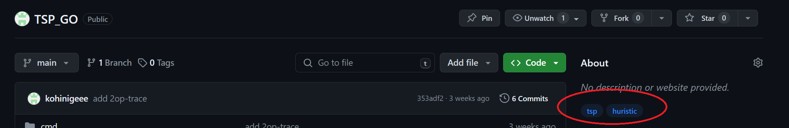

最終更新日付 2024/03/11

# 本ページについて
本ページには、本研究室におけるGithubの暫定的な運用ルールについて記します。


# リポジトリーの命名規則

リポジトリーの一覧画面での視認性や探索性を高めるために、作成リポジトリーの命名については以下の規則にしたがってください。
以下の文字列の`{}`の部分を各人の値に置き換えてリポジトリー名を構築してください。

```: 命名規則
{年度}_{学年}_{名字}_{プロジェクト名}
```

#### パラメータの説明

| パラメータ名 | 説明 |
|-------------|-------------|
| 年度          | リポジトリー作成時の年度 (西暦)    |
| 学年          | リポジトリー作成者の学年 (B4, M1, M2のどれか)|
| 名字          | リポジトリー作成者の名字 (ヘボン式ローマ字)|
| プロジェクト名 | 任意の文字列|

例： 2024_M2_Yamada_TestProject

#### ※学年と名字が衝突する場合
学年と名字がともに衝突する場合は、フルネームなどを用いて適宜衝突を回避してください

# リポジトリーのトピック
検索効率をあげるために、リポジトリーのプロジェクト内容に関連するタグのようなものを、プロジェクト内容に応じて`トピック機能`を用いて追加してください。
追加方法については[こちら](https://docs.github.com/ja/repositories/managing-your-repositorys-settings-and-features/customizing-your-repository/classifying-your-repository-with-topics)を参照してください。
トピックを追加すると、以下のように表示されます。




また、各人によって同じトピックへのトピック名に対してばらつきが生じないように、有名どころのトピックに関しては事前に定めたトピック名をプロジェクトに設定してください。

以下の表がトピック内容とトピック名の対応表となります。

### ※対応するトピック名が無い場合
トピック内容に対応するトピック名が無い場合は、**その旨を研究室のSlackなどに報告して新しいトピック内容とトピック名のペアを決定後、本ドキュメントに追加**してから利用してください。


### プロジェクトの種類
| トピック内容 | トピック名 |
|-------------|-------------|
| 研究 | reserch |
| 手順書・ドキュメント| document|
| 開発| development|

### 数理計画問題
| トピック内容 | トピック名 |
|-------------|-------------|
| Travel Salesman Problem (TSP)     | tsp   |
| Vehicle Routing Problem (VRP)     | vrp   |
| | |

### アルゴリズム
| トピック内容 | トピック名 |
|-------------|-------------|
| ダイクストラ法 | dijkstra |
| | |

### プログラミング言語
| トピック内容 | トピック名 |
|-------------|-------------|
| C| c-lang|
| C++| c++|
| Java | java|
| Rust| rust|
| Go lang| golang|
| TeX| tex|
| | |

